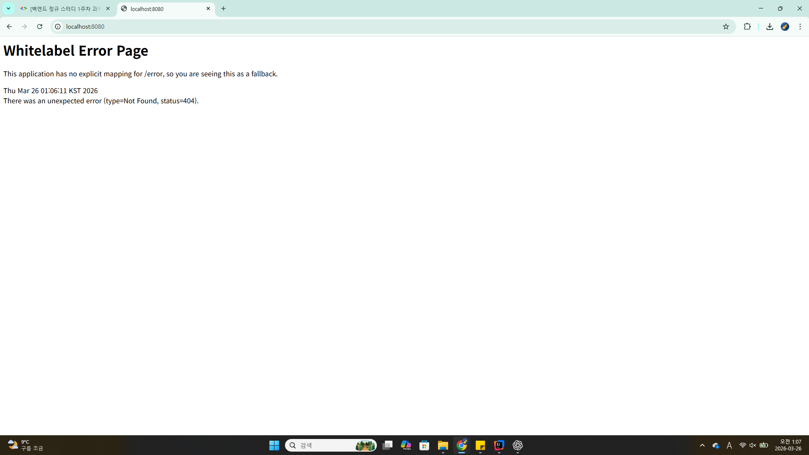

## API 명세서

# 상품 기능

1. 상품 정보 등록
HTTP Method : POST
URI : /products

2. 상품 목록 조회
HTTP Method : GET
URI : /products

3. 개별 상품 정보 상세 조회
HTTP Method : GET
URI : /products/{productsid}

4. 상품 정보 수정
HTTP Method : PATCH
URI : /products/{productsid}

5. 상품 삭제
HTTP Method : DELETE
URI : /products/{productsid}

# 주문 기능
1. 주문 정보 생성
HTTP Method : POST
URI : /orders

2. 주문 목록 조회
HTTP Method : GET
URI : /orders

3. 개별 주문 정보 상세 조회
HTTP Method : GET
URI : /orders/{ordersid}

4. 주문 취소
HTTP Method : DELETE
URI : /orders/{ordersid}

## 1주차에 학습한 내용
* 백엔드와 프론트엔트의 차이점, 하는 일에 대해 대략적으로 알게 됨

* HTTP가 어떻게 작동하는지, API가 무엇인지 대략적으로 알게 됨

* 프레임워크라는 개념도 새로 알게 되었다

